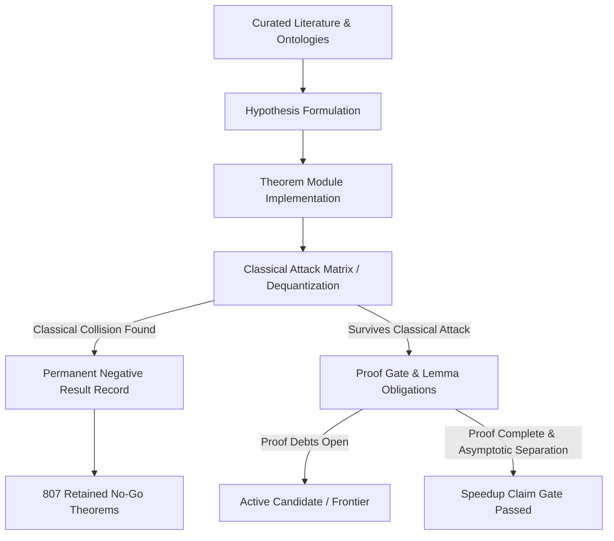

# Q-Search: Proof-Gated Quantum Algorithm Research Engine

[](https://github.com/Jaspersands/qsearch/actions/workflows/validate.yml)
[](https://jaspersands.github.io/qsearch/)
[](https://jaspersands.github.io/qsearch/)
[](https://jaspersands.github.io/qsearch/negative-results.html)

**Q-Search** is an automated, proof-gated research platform designed to investigate structural quantum algorithms for hard classical computational problems.

Rather than optimizing for small-scale demonstrations, toy circuits, or premature speedup claims on trivial instances, Q-Search systematically formulates high-upside quantum mechanisms, subjects them to automated classical attack suites, and permanently preserves negative results.

---

## Quick Navigation

- [Executive Summary](#executive-summary)
- [Live Research Dashboards](#live-research-dashboards)
- [Repository Architecture & Codebase Layout](#repository-architecture--codebase-layout)
- [Primary Research Tracks](#primary-research-tracks)
- [The Proof-Gated Operating System](#the-proof-gated-operating-system)
- [Getting Started & Quick Start](#getting-started--quick-start)
- [Categorized CLI Command Reference](#categorized-cli-command-reference)
- [Operating Contract & Model Allocation](#operating-contract--model-allocation)

---

## Executive Summary

The central question driving Q-Search is: **Can genuine polynomial or super-polynomial quantum speedups be established for non-abelian hidden subgroup problems, linear code equivalence, or dihedral coset instances without falling to classical dequantization?**

### The Core Problem with Standard Circuit Searches
1. **Toy Instance Illusions**: Small circuits ($n \le 3$) often show high simulated success rates that merely rediscover trivial parity relations (Bernstein-Vazirani) without scaling.
2. **Classical Dequantization**: Many heuristic quantum observables can be simulated efficiently by classical Information-Set Decoding (ISD), Weisfeiler-Leman (WL) graph refinements, sparse Fourier sampling, or lattice BDD heuristics.
3. **Erased Dead Ends**: Unrecorded negative experiments lead subsequent research into cyclical, redundant investigations.

### The Q-Search Solution: Proof-Gated Defense
Q-Search enforces a strict **claim-gating policy**:
- **724 Verified Theorem Modules**: Every hypothesis is codified into an executable verification module with explicit mathematical kill criteria.
- **1,211 Dequantization Attacks**: Automated classical attack scanners test every quantum state-access model against correlation attacks, derivative spectra, and algebraic invariant learners.
- **807 Retained Negative Results**: Every falsified claim or classical collision is permanently recorded in the registry (`research/registry/negative_results.json`).
- **Speedup Claims Blocked**: The registry actively gates `speedup_claim_allowed = False` until a candidate provably defeats all named classical baselines across asymptotic families.

---

## Live Research Dashboards

Interactive data portals are deployed via GitHub Pages:

| Dashboard | Description | Live Link |
|---|---|---|
| **Live Progress** | Real-time research position, signal pipeline, milestones, and active conjectures | [index.html](https://jaspersands.github.io/qsearch/) |
| **Research Methodology** | Operating principles, diagnosis of failure modes, and proof-gate contracts | [methodology.html](https://jaspersands.github.io/qsearch/methodology.html) |
| **Frontier Map** | Machine-readable topological map of active research frontiers and kill criteria | [frontier.html](https://jaspersands.github.io/qsearch/frontier.html) |
| **Negative Results** | Searchable database of 807 retained no-go theorems and dequantization findings | [negative-results.html](https://jaspersands.github.io/qsearch/negative-results.html) |
| **Proof Debt** | Live ledger of 24 open proof obligations, 1,184 lemmas, and reduction edges | [proof-debt.html](https://jaspersands.github.io/qsearch/proof-debt.html) |
| **Repository Map** | Interactive codebase architecture explorer and 724-module taxonomy | [repomap.html](https://jaspersands.github.io/qsearch/repomap.html) |

---

## Repository Architecture & Codebase Layout

### Why is the Root Directory Structured with Flat Modules?
Q-Search contains **724 scientific verification modules**. The codebase intentionally maintains a flat module namespace with explicit domain prefixes rather than deep nested packaging:

```text
quantum-algorithm-search/
├── qsearch.py                     # Unified CLI entry point for all 724 subcommands
├── research_registry.py           # Canonical schema for candidates, experiments, results, and debts
├── experiment_runner.py           # Experiment execution dispatcher and run history
├── proof_gate.py                  # Formal candidate proof obligation and verification engine
├── dequantization_checks.py       # Automated classical attack matrix scanner
│
├── dcp_*.py                       # Dihedral Coset Problem (DHSP) & state-native sieves (43 modules)
├── coset_*.py, cfi_*.py           # Non-abelian coset observables & S_n representation theory (155 modules)
├── self_dual_wreath_*.py          # Self-dual wreath product representations & polar audits (189 modules)
├── code_*.py, goppa_*, bch_*      # Linear code equivalence & automorphism baselines (128 modules)
├── character_*, phase_*           # Phase family naturalness & Fourier bridge baselines (112 modules)
│
├── research/                      # Canonical JSON registries & empirical attack artifacts
│   ├── registry/                  # candidates.json, experiments.json, negative_results.json, etc.
│   ├── classical_baselines/       # Dequantization and classical attack outputs
│   ├── progress_snapshot.json     # Curated telemetry feed powering public web dashboards
│   └── frontier_map.json          # Structured research frontier topology
│
├── site/                          # Frontend dashboard assets (styles.css, progress.js)
├── tools/                         # Maintenance utilities (build_progress_snapshot.py, etc.)
├── docs/                          # Human-readable repository maps and specifications
└── tests/                         # Unit tests, integration tests, and runner dispatch suites
```

**Benefits of this Architecture:**
1. **Zero Packaging Friction**: Any module can be run directly via `python3 <module>.py` or through the unified CLI `python3 qsearch.py <command>`.
2. **Path Uniformity**: No relative import ambiguity (`..`) across diverse local environments, cloud runners, and CI pipelines.
3. **Domain Segregation by Prefix**: Clear functional ownership (`dcp_`, `coset_`, `self_dual_wreath_`, `code_`).

---

## Primary Research Tracks

### 1. Dihedral Hidden Subgroup Problem (DHSP) & Sieve (`DHS-GOWERS-SIEVE`)
- **Objective**: Recover hidden dihedral reflections from independent coset-state samples over $D_N$.
- **Key Mechanisms**: Uniform state-native sum/difference measurements, recursive multi-stage decoders, and bad-register contamination witnesses ($1/\log N$ arbitrary error rate).
- **Core Results & No-Go Theorems**:
  - *Lucas Carry ANF Invariance*: Proved that arbitrary dense invertible affine Boolean preprocessing $\text{GL}(m, 2)$ preserves linear algebraic-normal-form degree for 2-adic carries.
  - *High-Quotient Distribution No-Go*: Proved that low-only carry selection leaves the high quotient distribution generic, preventing shortcut lattice attacks without full joint constraints.

### 2. Non-Abelian Coset States & Code Equivalence (`CODE-COSET-COLLECTIVE`)
- **Objective**: Test linear code equivalence over finite fields using collective coset observables.
- **Key Mechanisms**: Commutant algebras of symmetric group representations, Jucys-Murphy elements, Racah recoupling coefficients, and wreath product Hecke algebras.
- **Core Results & No-Go Theorems**:
  - *PGM Polar Boundary*: Established exact quantum capacity limits on low-register tensor observables.
  - *Master Walsh Flatness No-Go*: Proved that hyperoctahedral adaptive Walsh operators suffer exponential signal cancellation on regular orbits.

### 3. Graph Isomorphisms & Combinatorial Reductions
- **Objective**: Investigate algebraic and combinatorial invariants beyond strong Fourier sampling.
- **Key Mechanisms**: Cai-Fürer-Immerman (CFI) gadget pairs, higher-order Weisfeiler-Leman invariants, and graphlet tensor contractions.

---

## The Proof-Gated Operating System



---

## Getting Started & Quick Start

### Prerequisites
- Python 3.11+ (Tested on Python 3.13)
- Node.js (for frontend static checking)

### Installation
```bash
git clone https://github.com/Jaspersands/qsearch.git
cd qsearch
pip install -r requirements.txt
```

### Core Audit & Verification Commands
Run a complete registry audit, check proof obligations, and validate data snapshots:

```bash
# 1. Run full registry and dequantization attack audit
python3 qsearch.py audit

# 2. Run dequantization scanner across all candidates
python3 qsearch.py dequantize

# 3. Validate entire research registry integrity (zero issues expected)
python3 qsearch.py validate

# 4. Rebuild the public dashboard progress snapshot
python3 tools/build_progress_snapshot.py
```

### Running Unit & Dispatch Tests
```bash
# Run candidate-specific unit tests
python3 -m pytest tests/test_dcp_carry_affine_degree_invariance.py

# Run dispatch verification across experiment runners
python3 -m pytest tests/test_experiment_runner.py
```

---

## Categorized CLI Command Reference

All 724 research workflows are accessible via `python3 qsearch.py <subcommand>`.

### Core Operating System Commands
```bash
python3 qsearch.py audit                # Full literature, hypothesis, and registry audit
python3 qsearch.py hypothesize          # Generate proof-gated hypotheses from ontology
python3 qsearch.py dequantize           # Run classical attack matrix and dequantization scan
python3 qsearch.py validate             # Validate registry consistency and claim gates
python3 qsearch.py literature           # Extract mechanisms from seed literature
python3 qsearch.py frontier             # Rebuild and inspect research frontier topology
```

<details>
<summary><strong>Dihedral Coset Problem (DCP) & Phase Sieve Commands (Click to expand)</strong></summary>

```bash
python3 qsearch.py dcp-samples --n-values 8,10,12 --sample-count 4096
python3 qsearch.py dcp-decode --n-values 8,10,12 --samples-per-stage 4096
python3 qsearch.py dcp-recurrence --n-values 8,12,16,20,24 --trials-per-point 12
python3 qsearch.py dcp-schedules --n-values 20,24,28,32 --budget-multiplier 2.0
python3 qsearch.py dcp-uniform-schedules --train-n-values 20,24,28 --unseen-n-values 32,36,40
python3 qsearch.py dcp-bad-registers --n-values 12,16,20,24
python3 qsearch.py dcp-contamination --n-values 8,10,12,14,16 --register-fractions 0.25,0.5,1.0
python3 qsearch.py dcp-witness-search --n-values 12,16,20,24 --maximum-weight 4
python3 qsearch.py dcp-clifford-witnesses --n-values 8,10,12,14,16
python3 qsearch.py dcp-clifford-contamination --n-values 6,8,10,12
python3 qsearch.py dcp-hadamard-scaling --n-values 6,8,10,12 --register-ratios 0.5,1.0,1.5,2.0
python3 qsearch.py dcp-random-decoder --n-values 8,10,12,14,16
python3 qsearch.py dcp-decoder-frontier
python3 qsearch.py dcp-multiscale-aliasing
python3 qsearch.py dcp-carry-high-part
python3 qsearch.py dcp-carry-affine-degree-invariance
python3 qsearch.py dcp-boolean-coset-separation
python3 qsearch.py dcp-marker-list-decoder
python3 qsearch.py dcp-marker-deviations
python3 qsearch.py dcp-marker-all-targets
python3 qsearch.py dcp-marker-vulnerable-coordinates
python3 qsearch.py dcp-marker-chart-union
python3 qsearch.py dcp-marker-target-beam
python3 qsearch.py dcp-pgm-gram-block-encoding
python3 qsearch.py dcp-pgm-qsvt-degree-obstruction
python3 qsearch.py dcp-coherent-fiber-erasure-boundary
python3 qsearch.py dcp-global-erasure-inversion-reduction
python3 qsearch.py dcp-approximate-erasure-coherence-reduction
python3 qsearch.py dcp-erasure-perturbation-reduction
```
</details>

<details>
<summary><strong>Non-Abelian Coset States & Symmetric Group Commands (Click to expand)</strong></summary>

```bash
python3 qsearch.py coset-state
python3 qsearch.py coset-collective-search
python3 qsearch.py coset-pgm-capacity
python3 qsearch.py coset-holevo
python3 qsearch.py coset-stable-fourth-moment
python3 qsearch.py coset-stable-racah-spectrum
python3 qsearch.py coset-hidden-involution-binary-identification-self-reduction
python3 qsearch.py coset-hidden-involution-boundary-gauge-projection-commutation
python3 qsearch.py coset-hidden-involution-centralizer-fourier-transversal
python3 qsearch.py coset-hidden-involution-commutant-basis-closure
python3 qsearch.py coset-hidden-involution-degree-profile-subduction-uniqueness
python3 qsearch.py coset-hidden-involution-gelfand-tsetlin-chain-orthogonality
python3 qsearch.py coset-hidden-involution-hecke-generator-exchange-reduction
python3 qsearch.py coset-hidden-involution-highest-weight-multiplicity-separation
python3 qsearch.py coset-hidden-involution-pair-matching-charge-hierarchy
python3 qsearch.py coset-hidden-involution-racah-tensor-inversion-stability
python3 qsearch.py cfi-code-reduction
python3 qsearch.py cfi-structural-decoder
```
</details>

<details>
<summary><strong>Self-Dual Wreath Product Representation Commands (Click to expand)</strong></summary>

```bash
python3 qsearch.py self-dual-wreath-spectrum
python3 qsearch.py self-dual-wreath-hecke-audit
python3 qsearch.py self-dual-wreath-pgm-polar-audit
python3 qsearch.py self-dual-wreath-adaptive-walsh-support-concentration-reduction
python3 qsearch.py self-dual-wreath-mrs-identification-escape-theorem
python3 qsearch.py self-dual-wreath-carrier-subspace-invariance
python3 qsearch.py self-dual-wreath-gpe-fusion-tree-cs-boundary
python3 qsearch.py self-dual-wreath-hyperoctahedral-subduction-rigidity
python3 qsearch.py self-dual-wreath-regular-master-walsh-flatness-no-go
python3 qsearch.py self-dual-wreath-orientation-fixed-space-recoupling
python3 qsearch.py self-dual-wreath-racah-decoupling-gauge-uniqueness
python3 qsearch.py self-dual-wreath-source-adaptive-walsh-collision-reduction
python3 qsearch.py self-dual-wreath-trace-biased-adaptive-walsh-no-go
```
</details>

<details>
<summary><strong>Linear Code Equivalence & Classical Attack Commands (Click to expand)</strong></summary>

```bash
python3 qsearch.py code-equivalence
python3 qsearch.py goppa-codes
python3 qsearch.py reed-muller-codes
python3 qsearch.py cyclic-codes
python3 qsearch.py bch-codes
python3 qsearch.py quasi-cyclic-codes
python3 qsearch.py code-structural-invariants
python3 qsearch.py code-tuple-profile-baseline
python3 qsearch.py code-schur-filtration
python3 qsearch.py support-splitting-baseline
python3 qsearch.py information-set-decoding-baseline
```
</details>

---

## Operating Contract & Model Allocation

Q-Search strictly separates cognitive research roles to maximize scientific output and precision:

1. **High-Reasoning Models (Codex)**:
   - Reserved for theorem derivations, mathematical mechanism formulation, representation-theoretic proofs, asymptotic complexity reductions, and decisive experiment design.
2. **Mechanical & Agentic Execution (Gemini / Antigravity)**:
   - Dedicated to CLI subparser generation, registry upserts, unit test creation, snapshot rebuilding, website maintenance, and GitHub Actions CI synchronization.

### Strict Claim Gating Rule
**No finite experiment or empirical success rate ($N \le 12$) is ever promoted to a quantum algorithmic speedup.** Breakthrough claims require a complete, uniform mathematical complexity proof establishing an asymptotic separation against all named classical baselines.
