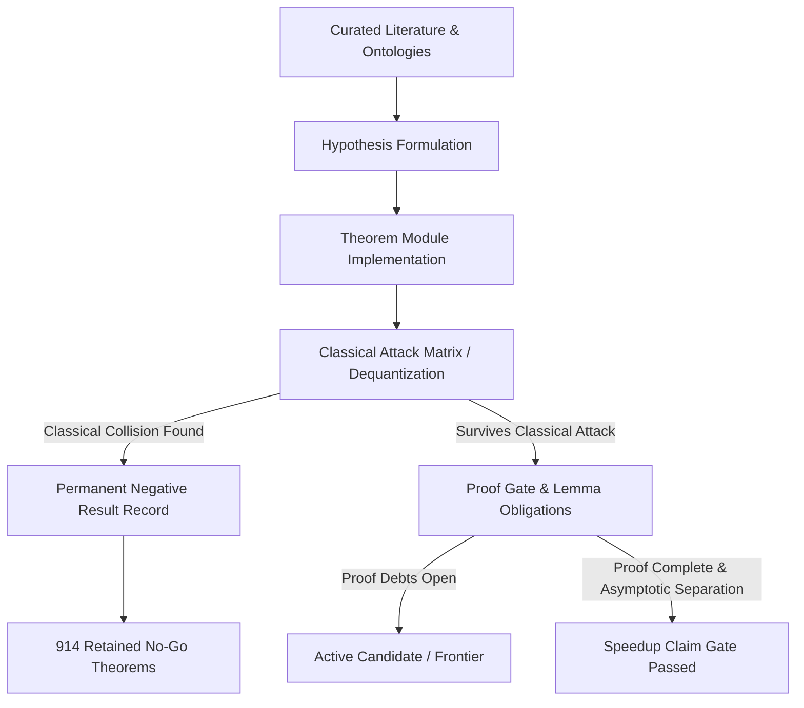

# Q-Search: Proof-Gated Quantum Algorithm Research Engine

[](https://github.com/Jaspersands/qsearch/actions/workflows/validate.yml)
[](https://jaspersands.github.io/qsearch/)
[](https://jaspersands.github.io/qsearch/)
[](https://jaspersands.github.io/qsearch/negative-results.html)

**Q-Search** is an automated, proof-gated research platform designed to investigate structural quantum algorithms for hard classical computational problems.

Rather than optimizing for small-scale demonstrations, toy circuits, or premature speedup claims on trivial instances, Q-Search systematically formulates high-upside quantum mechanisms, subjects them to automated classical attack suites, and permanently preserves negative results.

---

## Quick Navigation

- [Executive Summary](#executive-summary)
- [Live Research Dashboards](#live-research-dashboards)
- [Repository Architecture & Codebase Layout](#repository-architecture--codebase-layout)
- [Primary Research Tracks](#primary-research-tracks)
- [The Proof-Gated Operating System](#the-proof-gated-operating-system)
- [Getting Started & Quick Start](#getting-started--quick-start)
- [Categorized CLI Command Reference](#categorized-cli-command-reference)
- [Operating Contract & Model Allocation](#operating-contract--model-allocation)

---

## Executive Summary

The central question driving Q-Search is: **Can genuine polynomial or super-polynomial quantum speedups be established for non-abelian hidden subgroup problems, linear code equivalence, or dihedral coset instances without falling to classical dequantization?**

### Current Research Decision

**The missing result is an efficient receiver, not more infrastructure.**

The [collective-decoder audit](research/LINEAR_ERASURE_PRANGE_DUALITY.md)
now constructs partial four-message parity decoding, but also derives its
matched classical affine-mixture sampler. Their reconstruction/equation
matrices are transposes; exact duals certify optimality only within this
instrument family. Negative overlaps do not escape the affine counterpart.
The preceding [triple-block audit](research/PARITY_BLOCK_USD_PRANGE.md)
also falsifies unqualified coherent-prior and fixed-sign sampling claims.
These review-pending results eliminate false advantage signals, not establish
a new speedup. A useful next receiver must beat more than product decoding
or independent-clause Prange, with its actual coherent input and partition
normalization accounted for.

The latest [full-recovery capacity audit](research/NATIVE_RECOVERY_CAPACITY.md)
corrects the noisy-input examples: small approximation loss does not establish
recovery feasibility. Two copy profiles lack enough Hilbert-space dimension;
the original indexed profile cannot yield a nontrivial full-recovery guarantee
with its generic noise ledger at any weighted exposure. Larger-bank and
lower-noise controls are not excluded. These scoped, review-pending bounds
neither solve nor rule out general quantum LWE algorithms.
The subsequent [Gaussian-tail refinement](research/NATIVE_GAUSSIAN_BANK_ROBUSTNESS.md)
reopens the original indexed parameters: at the necessary capacity threshold,
its sharper noise loss is about0.143 rather than1. This uses an explicit
Gaussian source premise, falsified by a matching-moment heavy-tail control.
It remains a conditional error budget, not a constructed recovery algorithm.
Its scaling audit also rejects linear-size banks at exponential modulus and
polynomial phase exposure. The revised asymptotic target uses a quadratic-size
bank with polynomial exposure; clearing these necessary budgets does not prove
frequency coverage or efficient decoding.

A separate [cyclic-centre StateHSP receiver](research/CYCLIC_CENTRE_STATE_HSP_RECEIVER.md)
now specifies a costed constructive algorithm for odd-prime bilinear
extensions: paid sector copies, approximate commuting-overgroup extraction
and original-state phase recovery. Exact independent controls pass, but the
derivation needs external review. This is not a native DHSP receiver, a
general central-extension solver or a new classical-problem speedup.

The [vector-centre extension](research/VECTOR_CENTRE_STATE_HSP_TARGET.md)
uses bounded-memory zero-sum blocks of heterogeneous sectors, rather than
waiting for repeated labels. It recovers the full subgroup through a central
quotient on the original state's support. Exact independent instruments,
cost ledgers and source-specific basis-readout baselines are implemented;
the latter prevent an advantage claim from the calibration sources. General
nilpotency, a native full-depth receiver and external theorem review remain
open. The producer is `theorems/vector_centre_state_hsp_receiver.py --write`.
The [native source bridge](research/NATIVE_STATE_HSP_BRIDGE.md) now verifies
that ideal cyclotomic samples supply a copy-only StateHSP instance and retain
gap one under central descent. Naive descent still has growing-depth copy
and register costs; that is the next mathematical bottleneck.

The [native orbit-source audit](research/NATIVE_ORBIT_SOURCE_ACCESS.md)
now gives a one-copy conversion to ordinary coset mixed states. Its known
relative inverse does not supply fixed-purification reflection: whole
Fourier-label filters cannot be amplified with it. A noncentral countercontrol
does amplify but simply returns the original seed. Neither result solves
growing-depth recovery or establishes a new speedup.

The [noncentral-filter audit](research/NATIVE_NONCENTRAL_FILTER_TRADEOFF.md)
adds exact source-weighted amplification bounds and a critical counterexample:
the exponential low-rank cut does not apply to observed-label-dependent
filters. A cheap label-adaptive filter has constant success at growing roots,
but merely relocates the original qutrit. Direct stabilizer measurements are
the matched baseline for fixed-generator verification, not a classical solver.

The [word-orbit channel audit](research/NATIVE_DIAGONAL_ORBIT_CHANNEL.md)
goes beyond that rank cut: synchronized group readouts that never interfere
distinct original word orbits can be simulated with one native qutrit while
preserving all public labels. More copies do not rescue this restricted
receiver. Seed mixing escapes the cut and remains a legitimate research
direction; the result is not classical dequantization or general impossibility.

The [partial phase echo](research/NATIVE_PARTIAL_PHASE_ECHO.md) is a concrete
cross-orbit measurement with cleared scratch and a costed output law. All72
tested non-product records lose to their own matched LOCC baselines, including
for least-trit inference. A [scoped shifted-probe bound](research/NATIVE_ECHO_SHIFTED_PROBE_GATE.md)
obstructs small fixed-menu echoes near the information threshold; an exact
inverse-label counterexample prevents extending it to arbitrary adaptive
couplings. These are review-pending negative results, not an efficient decoder.

The [multi-round echo workbench](research/NATIVE_ECHO_HISTORY_RECEIVER.md)
now tests an actual escape from that one-echo cut. Its mediator-history
contraction charges width times depth; all96 non-product controls lose to
their own same-copy LOCC baselines. Conditional tensor simulation does not
solve unknown-secret inference or constitute classical dequantization.

The [one-use packet-line compiler](research/TERNARY_PACKET_LINE_RECEIVER.md)
shows that a known-line Bell readout, even with high-label-informed directions,
is exactly an ordinary packet restriction plus public randomness. It preserves
curved states and external references. Rare exact-affine admission is not an
information lower bound: non-affine lines still produce the existing noisy
field-readout family. A new receiver must do more than repackage that projection.

The [collective label-access gate](research/NATIVE_LABEL_ACCESS_GATE.md)
bounds even weak-trit inference for arbitrary collective measurements whose
quantum control reads only a label prefix, while allowing full-label classical
decoding. It is a review-pending sample/access tradeoff, not an exclusion of
all polynomial-copy receivers. Full-label operations remain outside its scope.

The [native character SDP decoder](research/TERNARY_CHARACTER_SDP_DECODER.md)
now tests computational recovery from lawful quantum-produced classical
records: complete moment constraints, secret-blind rounding, classical
multi-start baselines and fresh verification. Numerical feasibility, small
secret spaces and capped references do not establish scalable recovery.

The [full-root lattice baseline](research/TERNARY_MEASURED_LATTICE_DECODER.md)
recovers 3 of 12 fixed controls and fails all larger-root controls on fresh
data. A separate [native CVP reduction](research/TERNARY_NATIVE_CVP_REDUCTION.md)
derives recovery conditional on a norm9/8 approximate closest-vector solver
and a charged polynomial copy surplus. That solver is NOT implemented;
neither bounded failure nor the conditional reduction is a speedup claim.

The [full-record follow-up](research/TERNARY_FULL_RECORD_CVP.md) uses ALL
training records rather than small lattice subsets. It recovers only the two
small-root controls out of eight and gives five exact finite counterexamples
to this optimizer's9/8 approximation guarantee. All six larger-root controls
fail independent validation.

An [exact quotient compiler](research/TERNARY_QUOTIENT_CVP.md) then eliminates
mutually orthogonal code-zero directions while retaining their essential
periodic cost. The largest represented input has1024 dimensions but only59
remaining integer choices. A bounded search improves five training fits,
yet still fails all larger-root validation and retains four exact factor
counterexamples. This is a coordinate-level optimization: a systematic basis
already has just n=8 choices for this input, with the original q^n periodic
search intact. The59-coordinate count is not an intrinsic dimension reduction.
A [complete radius-search certifier](research/TERNARY_QUOTIENT_CVP_CERTIFIER.md)
proves the finite optimum for one small-root control; seven controls remain
explicitly UNKNOWN at the4096-extension cap. No scalable solver, search-cost
bound, inherited validation for changed outputs, or speedup follows.

The [noise-degradation source reduction](research/TERNARY_NOISE_DEGRADATION.md)
now transforms noisy linear CLASSICAL samples into approximate native measured
transcripts, with exact rejection decisions, source-rounding guards and all
TV/abort costs charged. It checks general-modulus search-LWE source theorem
parameters without importing a prime-only result. No decoder, unconditional
hardness claim or unknown quantum input is supplied by that classical subsystem.
A separate [direct noisy-phase input bridge](research/NATIVE_NOISY_PHASE_INPUT.md)
now supplies secret-blind, copy-only native qutrit GATE RECIPES from independent
noisy values, with averaged-state trace loss<=20V/q^2 per input. Its exact
even-level label compiler works beyond the old level512 cap. Shared-error
copy reuse fails an exact countercontrol; preparation and source-rounding
losses are charged. Hardware synthesis, an efficient growing-root receiver,
external composition/novelty review and any speedup remain open.
The [original-data baseline](research/NATIVE_PHASE_SOURCE_DOMINANCE.md) supplies
an exact discrimination dual: no prepared-state receiver gains information
over the original noisy classical records. This is NOT efficient classical
dequantization. Any computational advantage must beat matched original-data
attacks, not merely a weaker native readout. Sample count and noise quality
must also survive one joint error ledger.
An [indexed-access extension](research/NATIVE_NOISY_INDEXED_ACCESS.md) conditionally
supports approximate coherent phase queries and inverses on a FIXED original
bank. This is stronger than copy-only access, but it charges every phase power,
keeps errors fixed on reuse, and grants neither new labels nor an exact ideal
inverse. A polynomial-exposure receiver exploiting this interface is still
missing; encoding or source access alone is not the algorithm.

The SDP decoder's [exact finite gap certificates](research/TERNARY_CHARACTER_SDP_GAP_CERTIFICATE.md)
now prove that two higher-dimensional cohorts admit feasible pseudo-moments
scoring above EVERY genuine character. This refutes universal tightness of
that specific relaxation, not other sample regimes or the original problem.

The [complete cyclic positivity repair](research/TERNARY_CHARACTER_CYCLIC_DECODER.md)
rejects those old witnesses but still admits NEW exact finite gaps: both
harder cohorts satisfy every represented cyclic law without recovering the
secret. The [joint-plane audit](research/TERNARY_CHARACTER_JOINT_PLANE.md)
identifies three exact negative nine-sector joint probabilities in these
survivors. Exact uniform mixing then satisfies ALL these joint cuts while
preserving gaps above every genuine secret. Neither separate cyclic nor
these joint-plane marginals enforce global realizability. No scalable
receiver or speedup follows, and another solver run is not needed to expose
this finite limitation.

Imported breakthrough claims also need mathematical admission. The
[module-to-ideal literature audit](research/MODULE_IDEAL_METRIC_AUDIT.md)
records exact counterexamples to a claimed attack's stated base case and
tests missing metric/affine-decoding bridges. Engineered counterexamples are
not random-source hardness or cryptographic security guarantees.

The [depth-independent ridge factory](research/TERNARY_RIDGE_CANCELLATION.md)
now lowers phase degree while retaining the larger root, with explicit original
source costs. The [collective character receiver](research/TERNARY_COLLECTIVE_CHARACTER_RECEIVER.md)
tests a concrete readout rather than treating that degree drop as an algorithm.
Its exact feedforward has an exponential correct-yield ceiling. Keeping every
measurement outcome avoids that postselection claim, but the current likelihood
decoder still enumerates all secrets. Source-aware inference or a genuinely
different collective transform is the unresolved target; no speedup is claimed.
The [source-aware Fourier information bound](research/TERNARY_FOURIER_INFORMATION.md)
also shows that certified wider outputs yield about one bit each under this
fixed local measurement, not one trit per retained coordinate. Classical
inference must therefore charge the larger sample requirement.

The [character synchronization audit](research/TERNARY_CHARACTER_SYNCHRONIZATION.md)
distinguishes perfect phase fit from a valid shared secret. The
[observable moment audit](research/TERNARY_OBSERVABLE_MOMENT_LIFT.md) finds exact
higher-rank counterfeits even with full sparse translation consistency on the
actual native sources. An observable-basis circuit repairs a specific weighted
diagnostic at every rank, with a rational numerical-residual budget; native
noisy recovery remains unproved. The
[exact flat certificate](research/TERNARY_FLAT_CHARACTER_CERTIFICATE.md) now
verifies a supplied completion and extracts genuine secrets without a full
secret-grid search; finding the completion from noisy records is still open.
The [translation-stability audit](research/TERNARY_TRANSLATION_STABILITY.md)
retains both an obstruction to naive approximate rounding and a conditional
finite-order pair repair. Noisy recovery and a quantum speedup remain unproved;
no algorithm candidate is accepted.

The [sequential spectral extractor](research/TERNARY_SEQUENTIAL_SPECTRAL_EXTRACTION.md)
now gives conditional polynomial-disturbance moment rounding without global
commuting-matrix repair. Exact independent replay checks all live sampling
paths; its known-support controls remain limited to supplied matrices, not
learned native models. The [native spectral access audit](research/TERNARY_NATIVE_SPECTRAL_ACCESS.md)
then closes one tempting shortcut: diagonal encoding-commuting readout is
uninformative, and accurate fixed-character nondemolition generators are
obstructed on the underfull source. Extra copies remove that existence
obstruction but do not compile normalized fiber transport. Other collective
receivers and source-aware classical learners remain open; no speedup is claimed.

The [costed block walk](research/TERNARY_NATIVE_BLOCK_WALK.md) now tests an
actual conditional sampler: cheap small-support full-fiber moves freeze,
including an extensive-distance obstruction in the near-entropy regime.
Allowing temporary violations through
[soft fiber cooling](research/TERNARY_SOFT_FIBER_COOLING.md) repairs that
connectivity issue but not preparation: its binary-energy local parent has
an exponentially small population success ceiling at polynomial action.
This bound follows actual state transfer, not just a small gap. The separate
[residual-energy test](research/TERNARY_RESIDUAL_FIBER_COOLING.md) also blocks
cold local-parent evolution from a granted warm Gibbs state. Its hot-stage
dynamics, global operations and other receivers remain open, not ruled out.

The [hot phase/mixer test](research/TERNARY_HOT_PHASE_MIXER.md) now executes
one- and two-layer native circuits with matched rejection/Grover baselines.
A one-layer population bound survives public continuous angle tuning.
Five-word ternary torsion gives a concrete higher-order correlation beyond
that bound. The [complete two-layer weighted path law](research/TERNARY_TWO_LAYER_PATH_TRANSFER.md)
now retains all signed interference through137 integer-lattice states,
without enumerating the original word cube. Independent exact replay agrees.
The tested growing menus give essentially rejection-baseline performance;
structural bounds exclude the quarter-turn template and continuous angles
in the stated near-entropy regime. The
[exact continuous-loop certificate](research/TERNARY_CONTINUOUS_LOOP_CERTIFICATE.md)
removes that continuous bound's larger-batch slack and also covers fixed
coordinate-dependent mixer angles and arbitrary fixed residual phases.
Public label-trained function families are not covered. Different collective operations remain
open. No efficient receiver or speedup is supplied.

The native least-trit route still lacks a polynomial-time weak learner.
Classical two-witness searches fail to scale in the tested regimes; exact
[prefix and moment audits](research/TERNARY_PREFIX_MOMENTS.md) expose false
fractional solutions rather than construct larger-root witnesses.

The [proper-marginal proof control](research/NATIVE_PROPER_MARGINAL_GAP_DERIVATION.md)
now shows that pair PSD plus consistent distributions on EVERY proper subset
need not imply a global native solution. This is a representation warning,
not random-source hardness or a quantum lower bound.

The [native full-label coherent-edge receiver](research/TERNARY_COHERENT_EDGE_RECEIVER.md)
bypasses classical witness finding and gives a review-pending constant
population trit advantage with polynomial workspace. Its explicitly charged
generic search time is still exponential. Independent arithmetic and finite
unitary controls pass, including negative fixed-time and dirty-scratch
falsifiers. The next target is a structure-aware collective measurement that
removes that cost, not another finite pruning benchmark. No speedup is claimed.

The [native prefix Schmidt audit](research/TERNARY_PREFIX_SCHMIDT.md) additionally
shows why small final fibers do not justify cheap multiscale MPS simulation:
faithful middle-scale states require exponentially growing mean bond cost
under the stated source law and fixed cut. This is not quantum hardness;
implicit or observable-specific transforms remain open.

The [product-trine baseline](research/TERNARY_PRODUCT_TRINE.md) supplies an
ancilla-free randomized realization of the existing covariant measurement
and exact joint decoding for fixed Fourier records. A source-valid control
shows informative joint outcomes despite uniform individual marginals, but
the IID copy bound makes this fixed readout exponentially weak at M=nr-2.
Neither the simpler measurement nor the exponential reference decoder is a
new speedup; label-sensitive or collective receivers remain the target.

The [label-independent product POVM extension](research/TERNARY_BLIND_PRODUCT_GATE.md)
extends that copy-density obstruction to arbitrary fixed product measurements,
including their opposite-secret correlations. Label-aware local bases,
outcome-adaptive policies and polynomial sample surplus remain open.

The [source/resource audit](research/NATIVE_SOURCE_PRIORITY_AUDIT.md) separates
known DCP-to-native conversion from ungranted source supply. The target is
polynomial time AND polynomial copies, compared against published sieves on
both axes; current constructions neither meet that target nor establish an
LWE attack.

The [phase-feedback compiler](research/TERNARY_PHASE_FEEDBACK.md) checks that
public diagonal feedback before full covariant readout adds no information:
the same raw records reproduce its causal transcript. Fixed-trine readout
has a separately charged q^2/3 resampling cost, with explicit shortages and
limitations on batch-dependent policies. Original quantum inputs are not
classically simulated by either statement.

The [initial polynomial-phase compiler](research/TERNARY_SYNDROME_PHASE_COMPILER.md)
removes integer polynomial chirps of the complete frequency sum at r>=2
without changing uniform-secret mean success. It uses one measured derivative
trit and clean scratch, not a frequency-fiber inverse. Partial-block and
top-digit phases remain outside this particular equivalence; no efficient
receiver or pointwise secret guarantee is supplied.

The [single-layer Fourier gate](research/TERNARY_SINGLE_LAYER_FOURIER_GATE.md)
separately bounds ANY initial full-label-dependent collective diagonal phase
followed by fixed word Fourier readout. Exact native offset moments make its
mean trit signal exponentially weak at M=nr-2, including partial-block and
top-digit chirps. Label-independent word permutations and label-dependent
affine maps do not remove this obstruction. Noncommuting layers, label-aware
nonlinear maps and larger costed batches remain open, not established solutions.

The [batch-fiber route](research/TERNARY_BATCH_FIBER_COMPILER.md) gives a
conditional polynomial-supply architecture when q=poly(n), but its complete
reference transformation is exponential. Exact worst-case lexicographic
ranking has a model-counting reduction. A [clean affine alternative](research/TERNARY_AFFINE_LINE_EXTRACTOR.md)
has a typical coverage obstruction, even for polynomial label-chosen direction
menus. The revised target is a [costed nonlinear three-cycle action](research/TERNARY_NONLINEAR_CYCLE_COMPILER.md):
canonicalize three orbit words and erase the original index without global
ranking. At full depth, efficient evaluation AND adequate native coverage are
still missing. The [known shallow kernel action](research/TERNARY_SHALLOW_KERNEL_CYCLE.md)
already has a polynomial word algorithm and acceptance1; reusing its old
cycles at a prefix larger by J loses the exact mean survival factor J^(-2*n).
All three derivations are review-pending; no speedup is established.

The [correlated-packet acquisition](research/TERNARY_CORRELATED_PACKET_ACQUISITION.md)
now charges the original samples needed by the growing-depth carry track.
At K=2n it retains at least n joint logical registers from 2n*(n+1)^2 original
inputs after one root lowering. These are NOT independent native samples;
an efficient joint decoder and a useful full-depth transition remain missing.
The [packet Pauli audit](research/TERNARY_PACKET_PAULI_GATE.md) derives an exact
restricted-rank signal law and obstructs low-defined polynomial probe menus
in the constant-rate source regime. High-informed implicit observables and
collective decoding remain open; this is not a general receiver lower bound.

The [one-use quadratic-program receiver](research/TERNARY_QUADRATIC_PROGRAM_RECEIVER.md)
now extracts exact secret equations from suitable quadratic phase programs
without identical copies or an unknown inverse. Native calibration instruments
pass, but their engineered source geometry is not a scalable IID factory.
The [unmatched native cubic factory](research/TERNARY_CUBIC_PROGRAM_FACTORY.md)
now combines different supplied programs with signed one-use injections.
It cancels their cubic tops for all outcomes and has a locally derived uniform
equation-label law under an explicit IID original-input premise. Matching
copies are unnecessary at field root. Worst-case input cost is about n^15
per equation; known fixed-root sieves are already polynomial. Growing-depth
costs, upstream sample supply and independent mathematical review remain open.

The [compact growing-depth phase verifier](research/TERNARY_NATIVE_PHASE_IDENTITY.md)
now merges native programs at their actual roots without expanding high-degree
tensors. Exact valuation certificates and soundness-accounted random tests
distinguish true degree drops from false quadratic transfers. Root9/27 controls
already give exact quadratic counterexamples; a useful full-depth decoder
remains missing. The next target is
[depth-independent ridge cancellation](research/NATIVE_RIDGE_CANCELLATION_TARGET.md).

The [DCP pairing-program audit](research/DCP_PAIRING_PROGRAMS.md) now supplies
explicit conditional parity readouts, clean-workspace controls and an exact
coverage/noise tradeoff. Run `python qsearch.py dcp-coherent-matching`.
The [direct coherent-edge readout](research/DCP_COHERENT_EDGE_READOUT.md) now
avoids exponential lists, unique partners and vertex isolation. A shared
geometric Grover schedule has a derived positive interference kernel and
constant average signal under the stated noise model, with polynomial
workspace and linear-size phase-state batches. Time remains exponential. The sorted
join is retained as a classical partner-search baseline. No efficient decoder
or new speedup is claimed; the derivations await independent review.

The [DCP label-information audit](research/DCP_LABEL_DIGEST_AUDIT.md) now checks
the physical scope of the recent GRZ digest obstruction and a review-pending
joint-summary extension. Run `python qsearch.py dcp-label-digest-audit`.
Stable high-bit summaries after low-subset-sum measurement are not a viable
decoder route at polynomial sample counts. Full-label-sensitive operations
and different prefixes remain outside that conclusion; no speedup is claimed.

The latest audit rules out one specific target: a single bounded-norm,
inverse-polynomial-gap operator cannot completely label typical hidden-involution
multiplicity blocks. The same packing bound applies to any fixed number of
commuting operators. This is not an HSP or general circuit lower bound.
The next useful target is an adaptive coarse-label hierarchy or direct
source-aware transform, not another fitted global separator.
See [the derivation, assumptions, and attempted refutations](research/SPECTRAL_LABEL_BUDGET.md).
The follow-up [signed-tensor access audit](research/SIGNED_TENSOR_ACCESS.md)
also shows why the faithful diagram regime misses typical required K-types.
It leaves physical quotient representations and implicit copy registers open.
The [encoded restriction workbench](research/ENCODED_RESTRICTION.md) now checks
normalized two-QFT carrier extraction, noncommuting logical orbit averages,
and physical coset-register conventions. Its reference-orbit audit bounds
fixed-reference invariant **identification**, not binary class detection.
The [reference-discard audit](research/REFERENCE_TWIRL_INFORMATION.md) separately
bounds binary information after independent carrier/type discard. A joint
measurement on the remaining copy codes cannot recover the erased signal;
classical adaptive references still obey a weaker bound when fresh inputs
are twirled before memory interaction. A constructive coherent-reference
countercheck recovers the original input after carrier erasure by moving
its information first. This escapes that assumption, not the hard decoding
problem. Fully coherent access and one global reference twirl remain open.
The [binary instrument evaluator](research/BINARY_CARRIER_INSTRUMENTS.md)
now measures actual outcome laws and disturbance. Its small-group alternating
carrier gains are reproduced by a latent-irrep model after a joint quantum
label front end; that front end has not been classically replaced. These
are calibration controls, not candidate algorithms.
Its [instrument implementation audit](research/BINARY_CARRIER_INSTRUMENTS.md#clean-label-access-is-not-reference-discard)
now checks clean GPE compute-copy-uncompute. Discarding the Fourier workspace
can preserve label probabilities while destroying the needed quantum state.
The clean label primitive is available conditionally on charged QFT/group-action
access; the growing-copy decision rule remains missing.
Exact fixed-point-free character arithmetic now scores supplied labels through
degree 4096 without tableau enumeration. Typed mutation search distinguishes
binary detection from hidden-element identification and retains one explicitly
incomplete growing-copy binary proposal. Known logarithmic-copy information
bounds are no longer listed as unresolved compiler requirements.
The first growing-copy route tested has a precise limitation: a fixed subset
palette exposes only one effective coset sample per membership-pattern cell.
This rules out amplifying raw copy counts with a fixed small palette. A
[separate source-conditioned bound](research/SOURCE_CONDITIONED_PALETTE.md)
also limits fixed preselected cell profiles when all classical source labels
are kept, by retaining small cells as fully charged quantum inputs.
It explicitly tests persistent conditional modes and missing-irrep measurement
extensions. Classical adaptation among a small predetermined whole-execution
catalogue is also bounded without normalizing selected successes. Succinct
exponential catalogues, coherent selectors and growing palettes remain outside
the useful bound; the derivation is review-pending, not an algorithm or a
novelty claim.
The [coherent subset-phase query](research/COHERENT_SUBSET_PHASE_QUERY.md)
now specifies an actual measurement family with polynomial primitive counts.
Independent source-conditioned kernels verify its finite readouts. The S4
signal beats one pair but loses to pair-plus-total; no scalable classifier
is established. A separate discarded-label bound does not apply to the
retained-source experiment, whose label/selector correlations matter.
Exact Walsh contractions now test larger copy counts, with disjoint-pair
baselines; S4's remaining gain uses a commuting V4-supported phase. A separate
review-pending bound limits fixed low-order selector marginals even with all
source labels, but leaves collective full-output classification open.
The [terminal readout analysis](research/COHERENT_TERMINAL_READOUTS.md) now
implements explicit parity/threshold rules. Fixed parities reduce to random
two-subset tests; a source-uniform Fourier-envelope bound also limits the
corrected all-zero rule despite its finite success. Source-aware majority
remains outside that argument, not an established algorithmic advantage.
The [source-selected parity test](research/SOURCE_SELECTED_PARITY.md) now
goes beyond that scope with exact character contractions through S6. Its
corrected negative-character rule loses to even one pair for every copy
count k>=2 at S6, certified by an exact finite prefix and a decreasing tail.
This is a scoped negative result, not a growing-degree no-go or a speedup.
The [full-source Walsh analysis](research/SOURCE_CATEGORY_WALSH.md) extends
the [corrected-output bound](research/CORRECTED_WALSH_WEIGHT.md): all source
irrep labels and complex central phases are now covered in the large
participating-copy regime, review pending. Exact joint laws expose source
information previously discarded and compare it with full pair likelihoods.
The intermediate copy window and multi-query measurements remain unresolved;
no scalable advantage, classical sampler or novelty claim is established.
The [streamed S8 orbit probe](research/SOURCE_ORBIT_CONTRACTION.md) now tests
the intermediate copy regime without a full group-pair matrix. Its ideal
sign-category/Walsh table loses to pair-count readouts at every tested point,
despite substantial information in the raw coset states. This eliminates
a specified finite readout, not the general intermediate regime.
The [quantum-selector extension](research/SOURCE_SELECTOR_QUANTUM_BOUND.md)
now bounds the state before any final selector measurement, with classical
source labels retained and fixed-weight mask probabilities charged. It extends
to noncentral common group-algebra unitaries, provided one shared unknown
involution is averaged over its class AFTER tensor products. The
[typical-mask refinement](research/TYPICAL_MASK_OBSTRUCTION.md) now gives a
review-pending obstruction for EVERY polynomial copy budget under this
architecture, including central-weight masks with charged overlap.
The [environmental-fidelity extension](research/MASK_TAIL_FIDELITY_OBSTRUCTION.md)
also obstructs masks with negligible mass below weight 3n at polynomial copy
counts, without any uniform-overlap penalty. Low-occupation masks, retained
physical data, source-adaptive operations and multiple queries remain
unresolved; all these derived bounds await independent and novelty review.
The [mask-symmetry reduction](research/SELECTOR_MASK_SYMMETRY.md) narrows fixed-mask
information optimization to k+1 Hamming-weight probabilities while preserving
cross-weight coherence. It does not make the objective or final measurement
efficient, and its finite optimization controls are not algorithm candidates.
The [vacuum-coherence bound](research/VACUUM_COHERENCE_BOUND.md) further bounds
only the extra information from superposing the empty subset. At polynomial
copy budgets that gain is negligible under the stated architecture; mutual
coherences between nonempty low-weight masks remain unresolved. This is a
review-pending derivation, not a total-information bound or novelty claim.
The [low-occupation support bound](research/LOW_OCCUPATION_SELECTOR_BOUND.md)
bounds entire masks below a growing weight threshold after charging their
physical support dimension. For K=n^2, support at weights <=n/4 is obstructed
asymptotically. Separate sector bounds cannot be combined by discarding coherence.
The [occupation-band localization](research/OCCUPATION_BAND_LOCALIZATION.md)
now charges the actual cross block for sufficiently separated low/high sectors.
At K=n^2 it makes nonnegligible mass between weights n/4 and 3n necessary
for a signal. The middle band and coherence with outside sectors remain
unresolved; this is not a sufficient condition or a working algorithm.
The [source-resolved spin-block audit](research/SOURCE_RESOLVED_SELECTOR_SCHUR.md)
preserves those coherences in an exact representation, but exposes its cost:
full irrep source labels are asymptotically distinct, leaving exponentially
large blocks under this symmetry alone. Coarsening sources can lose signal;
the reduction does not compile the remaining measurement.
The [coefficient-mass channel bound](research/SELECTOR_COEFFICIENT_MASS_BOUND.md)
covers every fixed mask for sufficiently small group-algebra coefficient mass.
Polynomial-support queries and single low-dimensional irrep reflections
cannot escape through the intermediate band. Larger-mass compiled queries
and changed physical access remain unresolved.
The [retained-data missing-harmonic detector](research/MISSING_HARMONIC_DETECTOR.md)
implements a costed measurement benchmark without a minimum-positive-gap
assumption. Its generic sqrt(n!) amplification is uncompetitive, not a
speedup. A scoped query-hybrid bound also rules out fixing it merely by
changing ancilla schedules while retaining the same missing-sign queries;
other data operations and implemented data readouts remain open.
The [source-adaptive extension](research/MISSING_SIGN_SOURCE_ADAPTATION.md)
also charges choosing subsets from full irrep labels, including the nonzero
information already in those labels. Other target sectors and noncentral
carrier operations remain outside these bounds.
Run `python qsearch.py coset-missing-harmonic` or
`python qsearch.py run EXP-COSET-MISSING-HARMONIC-DETECTOR`.
The [coherent overlap echo](research/COHERENT_OVERLAP_ECHO.md) now tests an
explicit retained-data sequence on nonmissing sectors, with a fixed X readout
and charged growing-copy resource schema. Exact S6 noncommuting controls lose
to the pair-plus-single baseline; growing-degree bias remains unproved.
Run `python qsearch.py coset-overlap-echo` or
`python qsearch.py run EXP-COSET-COHERENT-OVERLAP-ECHO`.
The [exact spatial transfer](research/COHERENT_OVERLAP_TRANSFER.md) evaluates
long one-round paths and certifies the fixed-S6 readout fails at **every** copy
count: even one pair measurement beats its global maximum. Growing degree
and multiple temporal rounds are not covered. Run
`python qsearch.py coset-overlap-transfer`; use `--replay` for exact saved-witness
and finite-prefix verification.
The [physical DCP witness audit](research/DCP_PHYSICAL_WITNESS_REDUCTION.md)
retracts the assumption that reversing an arbitrary measurement prepares a
uniform subset-sum fiber. A full-space counterexample preserves valid witness
support but not uniformity. The repaired unamplified compute-copy-uncompute
reduction gives average witness success at least the square of the decoder's
label-averaged success, without estimating that success or assuming typical
fiber occupancy. This is a review-pending reduction, not a new decoder or a
hardness theorem. Uniform-fiber entanglement exclusions must not be imported
through it. Run `python qsearch.py dcp-arbitrary-measurement-witness-reduction`.
The [classical value-access audit](research/CLASSICAL_VALUE_ACCESS_AUDIT.md)
replaces hidden full-table quadratic reconstruction with counted point queries,
including exact-residue controls on nonmaterializable domains. Sample-limited
exhaustive recovery is now distinguished from polynomial-time dequantization;
value-oracle attacks are not treated as attacks on DHSP phase states.
The same audit retracts the Fourier diagnostic's unsupported learner claims:
spectral concentration is not shift recovery, and superseded negatives are
preserved in a separate quarantine archive.
The [proof-route audit](research/PROOF_ROUTES.md) now checks scoped dependency
contracts and pinned evidence. It catches unsupported assertions without
pretending to check mathematical truth or cover the entire repository.

Source-ranked S_14 scans remain **numerical algebra diagnostics**. Reports now
retain generator matrices and separator coefficients for replay; caches are
bound to the branch, numerical basis, and contraction source. Failed numerical
searches remain inconclusive unless independently certified. No decoder or
new quantum speedup has been established.

### The Core Problem with Standard Circuit Searches
1. **Toy Instance Illusions**: Small circuits ($n \le 3$) often show high simulated success rates that merely rediscover trivial parity relations (Bernstein-Vazirani) without scaling.
2. **Classical Dequantization**: Many heuristic quantum observables can be simulated efficiently by classical Information-Set Decoding (ISD), Weisfeiler-Leman (WL) graph refinements, sparse Fourier sampling, or lattice BDD heuristics.
3. **Erased Dead Ends**: Unrecorded negative experiments lead subsequent research into cyclical, redundant investigations.

#### The Q-Search Solution: Proof-Gated Defense
Q-Search enforces a strict **claim-gating policy**:
- **Executable Research Checks**: Modules contain derivations, finite diagnostics, and assumptions. Passing Python tests is not a machine-checked mathematical proof.
- **Classical Baselines and Access Audits**: Implemented attacks and model checks can falsify proposals; surviving them is not a classical lower bound.
- **Negative Results**: Scoped obstructions and failed hypotheses are retained in `research/registry/negative_results.json`; record counts are not independent discoveries.
- **Speedup Claims Blocked**: The registry actively gates `speedup_claim_allowed = False` until a candidate provably defeats all named classical baselines across asymptotic families.

---

## Interactive Documentation Pages

The repository automatically publishes interactive research telemetry and database dashboards via GitHub Pages:

| Dashboard | Description | Live Page |
| :--- | :--- | :--- |
| **Progress Overview** | Real-time candidate pipeline, falsifier telemetry, and validation status | [index.html](https://jaspersands.github.io/qsearch/) |
| **Methodology** | Formal research principles, no-go mechanisms, and claim-gating philosophy | [methodology.html](https://jaspersands.github.io/qsearch/methodology.html) |
| **Frontier Map** | Machine-readable topological map of active research frontiers and kill criteria | [frontier.html](https://jaspersands.github.io/qsearch/frontier.html) |
| **Negative Results** | Searchable database of 914 retained no-go theorems and dequantization findings | [negative-results.html](https://jaspersands.github.io/qsearch/negative-results.html) |
| **Proof Debt** | Live ledger of 24 open proof obligations, 1,184 lemmas, and reduction edges | [proof-debt.html](https://jaspersands.github.io/qsearch/proof-debt.html) |
| **Repository Map** | Interactive codebase architecture explorer and 792-module taxonomy | [repomap.html](https://jaspersands.github.io/qsearch/repomap.html) |

---

## Repository Architecture & Codebase Layout

### Why is the Root Directory Structured with Flat Modules?
Q-Search contains **792 scientific verification modules**. The codebase organizes modules into domain-specific packages (`core/` and `theorems/`):

```text
quantum-algorithm-search/
├── core/                          # 22 Core Operating System & Proof Engine modules
│   ├── research_registry.py       # Canonical schema for candidates, experiments & results
│   ├── experiment_runner.py       # Experiment execution dispatcher and run history
│   ├── proof_gate.py              # Formal candidate proof obligation and verification engine
│   ├── dequantization_checks.py   # Automated classical attack matrix scanner
│   └── mutation_engine.py         # Automated hypothesis mutation generator
│
├── theorems/                      # 792 Scientific Theorem Verification modules
│   ├── dcp_*.py                   # Dihedral Coset Problem (DHSP) & state-native sieves
│   ├── coset_*.py, cfi_*.py       # Non-abelian coset observables & S_n representation theory
│   ├── self_dual_wreath_*.py      # Self-dual wreath product representations & polar audits
│   ├── code_*.py, goppa_*, bch_*  # Linear code equivalence & automorphism baselines
│   └── character_*, phase_*       # Phase family naturalness & Fourier bridge baselines
│
├── research/                      # Canonical JSON registries & empirical attack artifacts
│   ├── registry/                  # candidates.json, experiments.json, negative_results.json, etc.
│   ├── classical_baselines/       # Dequantization and classical attack outputs
│   ├── progress_snapshot.json     # Curated telemetry feed powering public web dashboards
│   └── frontier_map.json          # Structured research frontier topology
│
├── site/                          # Frontend dashboard assets (styles.css, progress.js)
├── tools/                         # Maintenance utilities (build_progress_snapshot.py, etc.)
├── docs/                          # Human-readable repository maps and specifications
├── tests/                         # Unit tests, integration tests, and runner dispatch suites
│
├── qsearch.py                     # The ONLY Python script at root (unified CLI entry point)
├── README.md                      # Modernized project guide
├── requirements.txt               # Dependencies
└── [6 HTML Dashboards]            # index.html, methodology.html, frontier.html, etc.
```

**Benefits of this Architecture:**
1. **Uncluttered Root**: Only `qsearch.py` and configuration files reside at root.
2. **Zero Packaging Friction**: All 792 workflows execute seamlessly via `python3 qsearch.py <command>`.
3. **Clean Separation of Concerns**: Core platform orchestration (`core/`) is cleanly separated from domain theorem proofs (`theorems/`).

---

## Primary Research Tracks

### 1. Dihedral Hidden Subgroup Problem (DHSP) & Sieve (`DHS-GOWERS-SIEVE`)
- **Objective**: Recover hidden dihedral reflections from independent coset-state samples over $D_N$.
- **Key Mechanisms**: Uniform state-native sum/difference measurements, recursive multi-stage decoders, and bad-register contamination witnesses ($1/\log N$ arbitrary error rate).
- **Core Results & No-Go Theorems**:
  - *Lucas Carry ANF Invariance*: Proved that arbitrary dense invertible affine Boolean preprocessing $\text{GL}(m, 2)$ preserves linear algebraic-normal-form degree for 2-adic carries.
  - *High-Quotient Distribution No-Go*: Proved that low-only carry selection leaves the high quotient distribution generic, preventing shortcut lattice attacks without full joint constraints.

### 2. Non-Abelian Coset States & Code Equivalence (`CODE-COSET-COLLECTIVE`)
- **Objective**: Test linear code equivalence over finite fields using collective coset observables.
- **Key Mechanisms**: Commutant algebras of symmetric group representations, Jucys-Murphy elements, Racah recoupling coefficients, and wreath product Hecke algebras.
- **Core Results & No-Go Theorems**:
  - *PGM Polar Boundary*: Established exact quantum capacity limits on low-register tensor observables.
  - *Master Walsh Flatness No-Go*: Proved that hyperoctahedral adaptive Walsh operators suffer exponential signal cancellation on regular orbits.
  - *Multiplicity Twirl Falsifier*: Sparse signed-sector projection matches an exact hyperoctahedral twirl and shows selected rank-seven multiplicity-three and nontrivial-beta blocks close by moved-point support at most five, refuting strict support-growth extrapolation while leaving uniformity and coherent access open.
  - *Source-Weighted High-Mass Scan*: A matrix-free signed-YJM fiber trace reaches the highest-mass previously untested repeated `S_14` branch (`b=26`, source mass `0.008705`). Support three generates only dimension 7, while a support-four subset has direct common-commutant nullity one with next singular value `0.223`. Audited source coverage rises to `0.008736`, still below one percent; exact all-rank closure, gap scaling, coherent access, and decoding remain open.

### 3. Graph Isomorphisms & Combinatorial Reductions
- **Objective**: Investigate algebraic and combinatorial invariants beyond strong Fourier sampling.
- **Key Mechanisms**: Cai-Fürer-Immerman (CFI) gadget pairs, higher-order Weisfeiler-Leman invariants, and graphlet tensor contractions.

---

## The Proof-Gated Operating System


```mermaid
graph TD
    A[Curated Literature & Ontologies] --> B[Hypothesis Formulation]
    B --> C[Theorem Module Implementation]
    C --> D[Classical Attack Matrix / Dequantization]
    D -->|Classical Collision Found| E[Permanent Negative Result Record]
    D -->|Survives Classical Attack| F[Proof Gate & Lemma Obligations]
    F -->|Proof Debts Open| G[Active Candidate / Frontier]
    F -->|Proof Complete & Asymptotic Separation| H[Speedup Claim Gate Passed]
    E --> I[914 Retained No-Go Theorems]
```

---

## Getting Started & Quick Start

### Prerequisites
- Python 3.11+ (Tested on Python 3.13)
- Node.js (for frontend static checking)

### Installation
```bash
git clone https://github.com/Jaspersands/qsearch.git
cd qsearch
pip install -r requirements.txt
```

### Core Audit & Verification Commands
Run a complete registry audit, check proof obligations, and validate data snapshots:

```bash
# 1. Run full registry and dequantization attack audit
python3 qsearch.py audit

# 2. Run dequantization scanner across all candidates
python3 qsearch.py dequantize

# 3. Validate entire research registry integrity (zero issues expected)
python3 qsearch.py validate

# 4. Rebuild the public dashboard progress snapshot
python3 tools/build_progress_snapshot.py
```

### Running Unit & Dispatch Tests
```bash
# Run candidate-specific unit tests
python3 -m pytest tests/test_dcp_carry_affine_degree_invariance.py

# Run dispatch verification across experiment runners
python3 -m pytest tests/test_experiment_runner.py
```

---

## Categorized CLI Command Reference

All 792 research workflows are accessible via `python3 qsearch.py <subcommand>`.

### Core Operating System Commands
```bash
python3 qsearch.py audit                # Full literature, hypothesis, and registry audit
python3 qsearch.py hypothesize          # Generate proof-gated hypotheses from ontology
python3 qsearch.py dequantize           # Run classical attack matrix and dequantization scan
python3 qsearch.py validate             # Validate registry consistency and claim gates
python3 qsearch.py literature           # Extract mechanisms from seed literature
python3 qsearch.py frontier             # Rebuild and inspect research frontier topology
```

<details>
<summary><strong>Dihedral Coset Problem (DCP) & Phase Sieve Commands (Click to expand)</strong></summary>

```bash
python3 qsearch.py dcp-samples --n-values 8,10,12 --sample-count 4096
python3 qsearch.py dcp-decode --n-values 8,10,12 --samples-per-stage 4096
python3 qsearch.py dcp-recurrence --n-values 8,12,16,20,24 --trials-per-point 12
python3 qsearch.py dcp-schedules --n-values 20,24,28,32 --budget-multiplier 2.0
python3 qsearch.py dcp-uniform-schedules --train-n-values 20,24,28 --unseen-n-values 32,36,40
python3 qsearch.py dcp-bad-registers --n-values 12,16,20,24
python3 qsearch.py dcp-contamination --n-values 8,10,12,14,16 --register-fractions 0.25,0.5,1.0
python3 qsearch.py dcp-witness-search --n-values 12,16,20,24 --maximum-weight 4
python3 qsearch.py dcp-clifford-witnesses --n-values 8,10,12,14,16
python3 qsearch.py dcp-clifford-contamination --n-values 6,8,10,12
python3 qsearch.py dcp-hadamard-scaling --n-values 6,8,10,12 --register-ratios 0.5,1.0,1.5,2.0
python3 qsearch.py dcp-random-decoder --n-values 8,10,12,14,16
python3 qsearch.py dcp-decoder-frontier
python3 qsearch.py dcp-multiscale-aliasing
python3 qsearch.py dcp-carry-high-part
python3 qsearch.py dcp-carry-affine-degree-invariance
python3 qsearch.py dcp-boolean-coset-separation
python3 qsearch.py dcp-marker-list-decoder
python3 qsearch.py dcp-marker-deviations
python3 qsearch.py dcp-marker-all-targets
python3 qsearch.py dcp-marker-vulnerable-coordinates
python3 qsearch.py dcp-marker-chart-union
python3 qsearch.py dcp-marker-target-beam
python3 qsearch.py dcp-pgm-gram-block-encoding
python3 qsearch.py dcp-pgm-qsvt-degree-obstruction
python3 qsearch.py dcp-coherent-fiber-erasure-boundary
python3 qsearch.py dcp-global-erasure-inversion-reduction
python3 qsearch.py dcp-approximate-erasure-coherence-reduction
python3 qsearch.py dcp-erasure-perturbation-reduction
```
</details>

<details>
<summary><strong>Non-Abelian Coset States & Symmetric Group Commands (Click to expand)</strong></summary>

```bash
python3 qsearch.py coset-state
python3 qsearch.py coset-collective-search
python3 qsearch.py coset-pgm-capacity
python3 qsearch.py coset-holevo
python3 qsearch.py coset-stable-fourth-moment
python3 qsearch.py coset-stable-racah-spectrum
python3 qsearch.py coset-hidden-involution-binary-identification-self-reduction
python3 qsearch.py coset-hidden-involution-boundary-gauge-projection-commutation
python3 qsearch.py coset-hidden-involution-centralizer-fourier-transversal
python3 qsearch.py coset-hidden-involution-commutant-basis-closure
python3 qsearch.py coset-hidden-involution-degree-profile-subduction-uniqueness
python3 qsearch.py coset-hidden-involution-gelfand-tsetlin-chain-orthogonality
python3 qsearch.py coset-hidden-involution-hecke-generator-exchange-reduction
python3 qsearch.py coset-hidden-involution-highest-weight-multiplicity-separation
python3 qsearch.py coset-hidden-involution-pair-matching-charge-hierarchy
python3 qsearch.py coset-hidden-involution-racah-tensor-inversion-stability
python3 qsearch.py coset-hidden-involution-multiplicity-twirl-projection
python3 qsearch.py coset-hidden-involution-multiplicity-fiber-trace
python3 qsearch.py coset-hidden-involution-high-mass-support-scan
python3 qsearch.py coset-hidden-involution-source-weighted-support-portfolio
python3 qsearch.py coset-hidden-involution-spectral-label-budget
python3 qsearch.py coset-hidden-involution-signed-tensor-access
python3 qsearch.py coset-hidden-involution-encoded-restriction
python3 qsearch.py coset-hidden-involution-reference-twirl-information
python3 qsearch.py coset-binary-carrier-instruments
python3 qsearch.py proof-routes
python3 qsearch.py run EXP-COSET-HIDDEN-INVOLUTION-SPECTRAL-LABEL-BUDGET
python3 qsearch.py coset-hidden-involution-natural-support-six-mass-audit
python3 qsearch.py cfi-code-reduction
python3 qsearch.py cfi-structural-decoder
```
</details>

<details>
<summary><strong>Self-Dual Wreath Product Representation Commands (Click to expand)</strong></summary>

```bash
python3 qsearch.py self-dual-wreath-spectrum
python3 qsearch.py self-dual-wreath-hecke-audit
python3 qsearch.py self-dual-wreath-pgm-polar-audit
python3 qsearch.py self-dual-wreath-adaptive-walsh-support-concentration-reduction
python3 qsearch.py self-dual-wreath-mrs-identification-escape-theorem
python3 qsearch.py self-dual-wreath-carrier-subspace-invariance
python3 qsearch.py self-dual-wreath-gpe-fusion-tree-cs-boundary
python3 qsearch.py self-dual-wreath-hyperoctahedral-subduction-rigidity
python3 qsearch.py self-dual-wreath-regular-master-walsh-flatness-no-go
python3 qsearch.py self-dual-wreath-orientation-fixed-space-recoupling
python3 qsearch.py self-dual-wreath-racah-decoupling-gauge-uniqueness
python3 qsearch.py self-dual-wreath-source-adaptive-walsh-collision-reduction
python3 qsearch.py self-dual-wreath-trace-biased-adaptive-walsh-no-go
python3 qsearch.py self-dual-wreath-branch-character-cyclic-polar-compiler
python3 qsearch.py self-dual-wreath-branch-character-cyclic-quadrant-overlap
python3 qsearch.py self-dual-wreath-branch-character-equivariant-multiplier-normal-form
python3 qsearch.py self-dual-wreath-branch-character-gpe-dilation-separation
python3 qsearch.py self-dual-wreath-branch-character-label-coherent-power-map-boundary
python3 qsearch.py self-dual-wreath-branch-character-naimark-autocorrelation-fourier-boundary
python3 qsearch.py self-dual-wreath-branch-character-natural-frobenius-word-map
python3 qsearch.py self-dual-wreath-branch-character-polar-naimark-completion
python3 qsearch.py self-dual-wreath-branch-character-power-map-fourier-access-boundary
python3 qsearch.py self-dual-wreath-branch-character-raw-concentration-central-fourier-bridge
python3 qsearch.py self-dual-wreath-branch-character-raw-polar-matched-filter-boundary
python3 qsearch.py self-dual-wreath-branch-character-sector-resolved-whitening-no-go
python3 qsearch.py self-dual-wreath-branch-character-whole-sum-path-erasure-boundary
python3 qsearch.py self-dual-wreath-joint-character-analysis-map-normalization
python3 qsearch.py self-dual-wreath-joint-character-natural-sector-mass
python3 qsearch.py self-dual-wreath-joint-character-purification-access-boundary
python3 qsearch.py self-dual-wreath-orientation-kernel-character-tensor-boundary
python3 qsearch.py self-dual-wreath-orientation-kernel-hash-normalization-no-go
python3 qsearch.py self-dual-wreath-schur-branch-merger-polar-equivalence
python3 qsearch.py self-dual-wreath-schur-dilated-multiplicity-access
python3 qsearch.py self-dual-wreath-split-sector-branch-regularity
python3 qsearch.py self-dual-wreath-trace-biased-coefficient-rank-no-go
python3 qsearch.py self-dual-wreath-schur-companion-transform-scope-boundary
python3 qsearch.py self-dual-wreath-addressed-cross-map-pair-polar-gram-boundary
python3 qsearch.py self-dual-wreath-addressed-cross-map-linear-assembly-normalization-boundary
python3 qsearch.py self-dual-wreath-natural-q-scale-spectral-window-no-go
python3 qsearch.py self-dual-wreath-final-root-metric-access-width-no-go
python3 qsearch.py self-dual-wreath-final-root-scalar-mixer-no-go
python3 qsearch.py self-dual-wreath-final-root-byproduct-covariance-no-go
python3 qsearch.py self-dual-wreath-final-root-physical-preparation-extension-scope-boundary
python3 qsearch.py self-dual-wreath-final-root-program-contraction-normalization-no-go
python3 qsearch.py self-dual-wreath-final-root-purification-naimark-program-boundary
python3 qsearch.py self-dual-wreath-final-root-state-preparation-oracle-query-boundary
python3 qsearch.py self-dual-wreath-final-root-addressed-weyl-assembly-boundary
python3 qsearch.py self-dual-wreath-recursive-polar-normalization-conservation-boundary
python3 qsearch.py self-dual-wreath-affine-gpe-nodelocal-naimark-access-boundary
python3 qsearch.py self-dual-wreath-positive-naimark-access-equivalence-boundary
python3 qsearch.py self-dual-wreath-hierarchical-endpoint-schur-algebra-boundary
python3 qsearch.py self-dual-wreath-affine-flag-aggregate-schur-query-boundary
python3 qsearch.py self-dual-wreath-affine-node-frame-response-boundary
python3 qsearch.py self-dual-wreath-scale-free-endpoint-graph-transfer-boundary
python3 qsearch.py self-dual-wreath-cayley-endpoint-gauge-compiler
python3 qsearch.py self-dual-wreath-affine-star-cayley-compiler
python3 qsearch.py self-dual-wreath-pair-carrier-label-contextuality
python3 qsearch.py self-dual-wreath-occupied-carrier-octahedral-boundary
python3 qsearch.py self-dual-wreath-plancherel-carrier-contextuality
python3 qsearch.py self-dual-wreath-plancherel-carrier-nonidentity-tail
python3 qsearch.py self-dual-wreath-plancherel-carrier-near-derangement-reduction
python3 qsearch.py self-dual-wreath-plancherel-carrier-asymptotic-closure
python3 qsearch.py self-dual-wreath-plancherel-carrier-racah-access-boundary
python3 qsearch.py self-dual-wreath-carrier-noncentral-readout-boundary
python3 qsearch.py self-dual-wreath-carrier-conditioned-pgm-boundary
python3 qsearch.py self-dual-wreath-carrier-holevo-budget-theorem
python3 qsearch.py self-dual-wreath-carrier-branch-pgm-success-certificate
python3 qsearch.py self-dual-wreath-disjoint-pair-branch-pgm-compiler-boundary
python3 qsearch.py self-dual-wreath-disjoint-pair-covariance-polar-reduction
python3 qsearch.py self-dual-wreath-dimensionless-pgm-truncation-bridge
python3 qsearch.py self-dual-wreath-local-block-metric-normalization-no-go
```
</details>

<details>
<summary><strong>Linear Code Equivalence & Classical Attack Commands (Click to expand)</strong></summary>

```bash
python3 qsearch.py code-equivalence
python3 qsearch.py goppa-codes
python3 qsearch.py reed-muller-codes
python3 qsearch.py cyclic-codes
python3 qsearch.py bch-codes
python3 qsearch.py quasi-cyclic-codes
python3 qsearch.py code-structural-invariants
python3 qsearch.py code-tuple-profile-baseline
python3 qsearch.py code-schur-filtration
python3 qsearch.py support-splitting-baseline
python3 qsearch.py information-set-decoding-baseline
```
</details>

---

## Operating Contract & Model Allocation

Q-Search strictly separates cognitive research roles to maximize scientific output and precision:

1. **High-Reasoning Models (Codex)**:
   - Reserved for theorem derivations, mathematical mechanism formulation, representation-theoretic proofs, asymptotic complexity reductions, and decisive experiment design.
2. **Mechanical & Agentic Execution (Gemini / Antigravity)**:
   - Dedicated to CLI subparser generation, registry upserts, unit test creation, snapshot rebuilding, website maintenance, and GitHub Actions CI synchronization.

### Strict Claim Gating Rule
**No finite experiment or empirical success rate ($N \le 12$) is ever promoted to a quantum algorithmic speedup.** Breakthrough claims require a complete, uniform mathematical complexity proof establishing an asymptotic separation against all named classical baselines.
